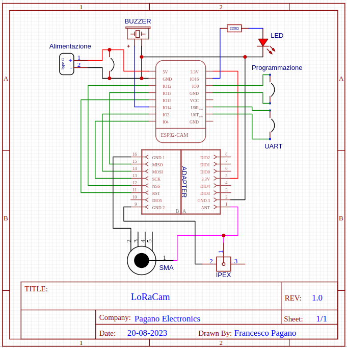
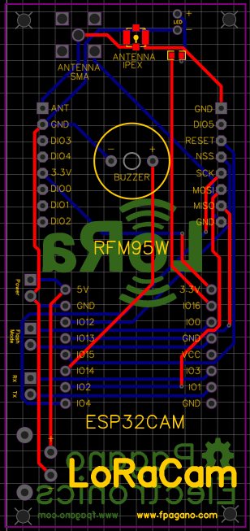
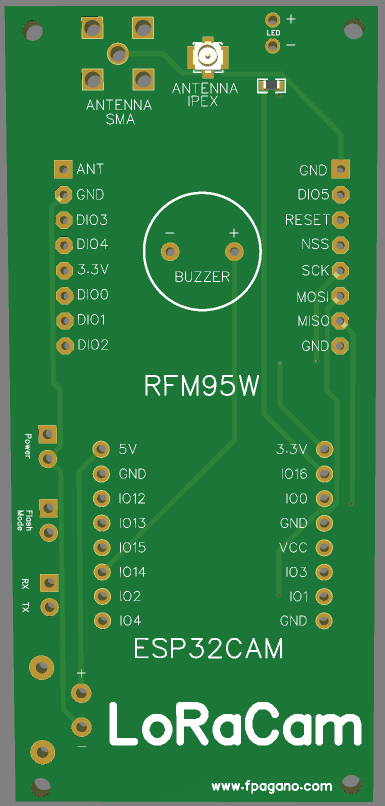

# LoRaCam
<h3 align="center">Welcome to the LoRaCam repo!</h3>

This project was born from the vision of another project ([StuartsProject](https://stuartsprojects.github.io/2021/11/21/StuartCAM-ESP32CAM-Picture-Transfers-with-LoRa.html)) which allows you to send images with an ESP32CAM using a RFM95W.

In particular, I created a custom PCB that allows you to simplify the connections.

<ul>
<li>First I created a schematic using EasyEDA.</li>
<li>Then I arranged the various components for the PCB.</li>
<li>And finally I placed the order on <a href="https://jlcpcb.com">JLCPCB</a> by importing the gerber file (<a href="https://github.com/Francesco-Pagano/LoRaCam/blob/main/LoRaCam_Gerber.zip">LoRaCam_Gerber.zip</a>) exported from EasyEDA.</li>
</ul>

| Schematic                            | PCB                                 | 3D View                                     |
| -----------------------------------  | ----------------------------------- | ------------------------------------------- |
|  |       |            |

Now, this PCB works perfectly with the project created by Stuart.

## But...
### Correction!!!
I noticed that there is a problem, the DIO0 of the RFM95W is not connected, this could be a problem for other uses.
Therefore I modified the PCB, removing the buzzer and connecting the IO14 of the ESP32CAM to the DIO0 of the RFM95W.

  

## Meshtastic
In addition, this PCB (<b>WITH THE CORRECTION!!!</b>) allows you to use [Meshtastic](https://meshtastic.org/)!

By copying the files into the [Meshtastic_variant](/Meshtastic_variant) folder of this repository and following the official [Meshtastic guide](https://meshtastic.org/docs/development/firmware/build) you can easily use it!

## Future Developments
The next step I want to take will definitely be to create a new PCB where I remove the buzzer and connect the DIO0 of the RFM95W to the ESP32CAM.
At the moment, I believe, there is no possibility to send images on Meshtastic. I hope that with the use of this PCB and the integration of Stuart's code it can be done somehow.
